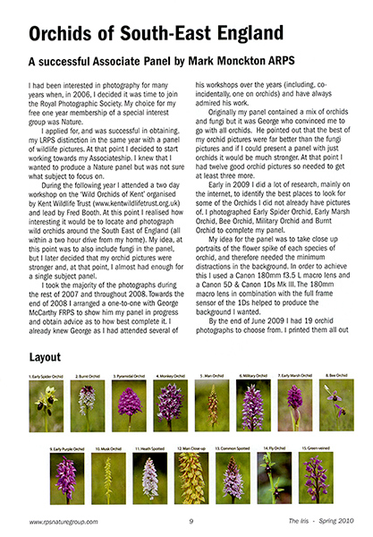

# Review of Basic Web Technologies

The majority of this class will be focused on JavaScript and how this language can be used in web design and development. Before we dive in to JavaScript though, lets review the three basic web technologies, along with their relationship to each other.

## Basic Info

JavaScript, along with HTML & CSS are the three "languages" that _POWER THE WEB_. (I used quotes around languages, because as you know, HTML & CSS are not true languages.) Through standardization processes, there is a worldwide agreement that any web browser be capable of understanding those three languages (and _only_ those three). It is essentially a contract, that allows developers to know, that if they create a web site using those standards, their site will work on any modern web browser. These languages, along with a few additional technologies, constitute the "Open Web Platform".

> Please read more about the ["Open Web Platform" from W3C.](https://www.w3.org/wiki/Open_Web_Platform)

# A Brief Review of Web Languages and Programming

Programming, or coding, is like solving a puzzle. In a human language like French or Arabic, the puzzle might be to translate a sentence perfectly. In programming, the puzzle could be to make a web page look a certain way, or to make an object on the page move.

So, when a web designer is given an end goal like "create a webpage that has this header, this font, these colors, these pictures, and an animated unicorn walking across the screen when users click on this button," the web designer's job is to take that big idea and break it apart into tiny pieces, and then translate these pieces into instructions that the computer can understand -- including putting all these instructions in the correct order or syntax.

Every page on the web that you visit is built using a sequence of separate instructions, one after another. Your browser (Chrome, Firefox, Safari, and so on) is a big actor in translating code into something we can see on our screens and even interact with. It can be easy to forget that code without a browser is just a text file -- it's when you put that text file into a _browser_ that the magic happens. When you open a web page, your browser fetches the HTML and other programming languages involved and interprets it.

HTML and CSS are actually not technically programming languages; they're just page structure and style information. But before moving on to JavaScript and other true languages, you need to know the basics of HTML and CSS, as they are on the front end of every web page and application.

In the very early 1990s, HTML was the only language available on the web. Since then, many tools, techniques, technologies, and languages have been added. However, it is still only the three (HTML, CSS, & JS) that browsers are guaranteed to work with.

## The TL:DR Version

An overview:

- **HTML** provides the _basic structure_ of sites, which is enhanced and modified by other technologies like CSS and JavaScript.
- **CSS** is used to control _presentation, formatting, and layout_.
- **JavaScript** is used to control the _behavior_ of different elements.

Now, let's go over each one individually to help you understand the roles each plays on a website and then we'll cover how they fit together.

## HTML

HTML is at the core of every web page, regardless of the complexity of a site or number of technologies involved. It's an essential skill for any web professional. It's the starting point for anyone learning how to create content for the web.

HTML stands for **H**yper**T**ext **M**arkup **L**anguage. The "markup language" part means that, rather than being a programming language that calculates or performs executes functions, it uses tags to identify content. HTML is used to structure web pages and is typically where the content (i.e. text and words) for a webpage live.

Let me show you what I mean. Take a look at the article below. If I were to ask you to label the types of content on the page, you'd probably do pretty well: There's the header at the top, then a subheader below it (level 2 header), the body text, and some images at the bottom followed by a few more bits of text.



Markup languages work in the same way as you just did when you labeled those content types, except they use "tags" to do it -- specifically, they use _HTML tags_. These tags have pretty intuitive names: Header tags, paragraph tags, image tags, and so on.

Every web page is made up of a bunch of these HTML tags denoting each type of content on the page. Each type of content on the page is "wrapped" in, i.e. surrounded by, HTML tags. The browser uses these tags to identify and create _HTML elements_.

For example, the words you're reading right now are part of a paragraph. When writing this web page from scratch, each paragraph starts with an opening paragraph tag: `<p>`. The "tag" part is denoted by open brackets, and the letter "p" tells the computer that we're opening a paragraph instead of some other type of content.

Once a tag has been opened, all of the content that follows is assumed to be part of that element until you "close" it with a _closing tag_. When the paragraph ends, I'd put a closing paragraph tag: `</p>`. Notice that closing tags look exactly the same as opening tags, except there is a forward slash after the left angle bracket. Here's an example:

```html
<p>This is a paragraph.</p>
```

Using HTML, you can add headings, format paragraphs, control line breaks, make lists, emphasize text, create special characters, insert images, create links, build tables, control some styling, and much more. Everything that has to do with document structure and content is typically handled with HTML.

## CSS

Whereas HTML was the basic structure of your website, CSS is what gives your entire website its style. Those slick colors, interesting fonts, and background images? All thanks to CSS. It affects the entire mood and tone of a web page, making it an incredibly powerful tool -- and an important skill for web developers to learn. It's also what allows websites to adapt to different screen sizes and device types.

To show you what CSS does to a website, look at the following two screenshots. The first screenshot is a blog post in Basic HTML, and the second screenshot is that same blog post with HTML _and_ CSS.

#### Screenshot with HTML (no CSS):


Notice all the content is still there, but the visual styling isn't. This is what you might see if the style sheet doesn't load on the website, for whatever reason. Now, here's what the same web page looks like with CSS added.

#### Screenshot with HTML + CSS:


Isn't that prettier?

Put simply, CSS is a list of rules that can assign different properties to HTML elements, either specified to single elements, multiple elements, an entire document, or multiple documents. It exists because, as design elements like fonts and colors were developed, web designers had a lot of trouble adapting HTML to these new features.

You see, HTML, developed back in 1990, was not really intended to show any physical formatting information. It was originally meant only to define a document's structural content, like headers versus paragraphs. HTML outgrew these new design features, and CSS was invented and released in 1996: All formatting could be removed from HTML documents and stored in separate CSS (`.css`) files.

So, what exactly does CSS stand for? It stands for **C**ascading **S**tyle **S**heets -- and "style sheet" refers to the document itself. Ever web browser has a default style sheet, so every web page out there is affected by at least one style sheet -- the default style sheet of whatever browser the web page visitor is using -- regardless whether or not the web designer applies any styles. For example, my browser's default font style is Times New Roman, size 12, so if I visited a web page where the designer didn't apply a style sheet of their own, I would see the web page in Times New Roman, size 12. When you see a basic webpage without CSS, the browser is applying its default style sheet to that page.

Obviously, the vast majority of web pages I visit don't use Times New Roman, size 12 -- that's because the web designers behind those pages started out with a default style sheet that had a default font style, and then they overrode my browser's defaults with custom CSS. That's where the word "cascading" comes into play. Think about a waterfall -- as water cascades down the fall, it hits all the rocks on the way down, but only the rocks at the bottom affect where it will end up flowing. In the same way, the last defined style sheet informs my browser which instructions have precedence.

## JavaScript

Unlike HTML or CSS, JavaScript is a _true_ programming language. It was initially released in 1995, five years after HTML. Nowadays, JavaScript is supported by all modern web browsers and is used on almost every site on the web for more powerful and complex functionality.

In short, JavaScript is a programming language that lets web developers design interactive sites. Most of the dynamic behavior you'll see on a web page is thanks to JavaScript, which augments a browser's default controls and behaviors.

One example of JavaScript in action is boxes that pop up on your screen. Think about the last time you entered your information into an online form and a confirm box popped up, asking you to press "OK" or "Cancel" to proceed. That was made possible because of JavaScript -- in the code, you'd find an "if ... else ..." statement that tells the computer to do one thing if the user clicks "OK," and a different thing if the user clicks "Cancel."

Another example of JavaScript in action is a "slide-in call-to-action", like the ones you may see on blog posts, often appearing on the bottom right-hand side of your screen when you scroll past the end of the sidebar. Here's what it looks like:


Other uses for JavaScript include security password creation, check forms, interactive games, and special effects. It's also used to build mobile apps and create server-based applications.


<div class="ref">

<h2>References and Resources</h2>

The above content was adapted from:

<ol>
<li><a href="https://blog.hubspot.com/marketing/web-design-html-css-javascript">Kolowich, Lindsay. "Web Design 101: How HTML, CSS, and JavaScript Work" HubSpot. October 09 2014, updated July 28 2017. Available from; https://blog.hubspot.com/marketing/web-design-html-css-javascript.</a></li>
<li><a href="https://www.google.com/search?q=nature+magazine+page&es_sm=91&source=lnms&tbm=isch&sa=X&ei=s-ouVNXwM42nyAT5n4HwDQ&ved=0CAgQ_AUoAQ&biw=1106&bih=587#facrc=_&imgdii=_&imgrc=o7ItkAs-GC2cMM%253A%3B1Nan7CZj-_SvrM%3Bhttp%253A%252F%252Fwww.markmonckton.co.uk%252Fimages%252Farticles%252Fnature-group-magazine-2010-1.jpg%3Bhttp%253A%252F%252Fwww.markmonckton.co.uk%252Fabout.php%3B417%3B600">Image Credit: Mark Monckton Photography</a></li>
</ol>

</div>
